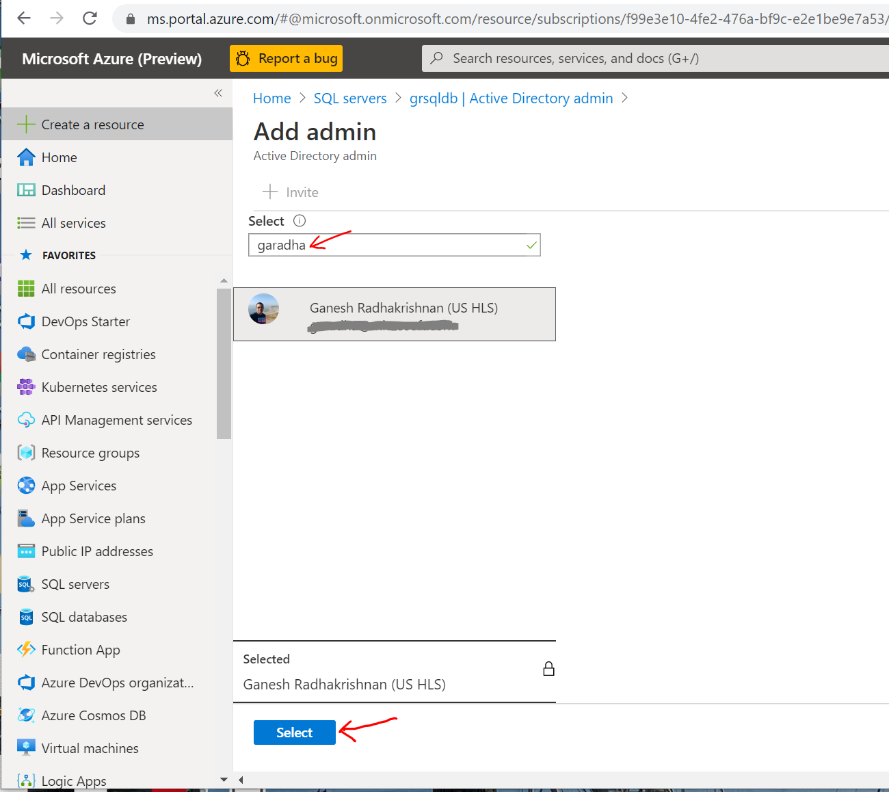
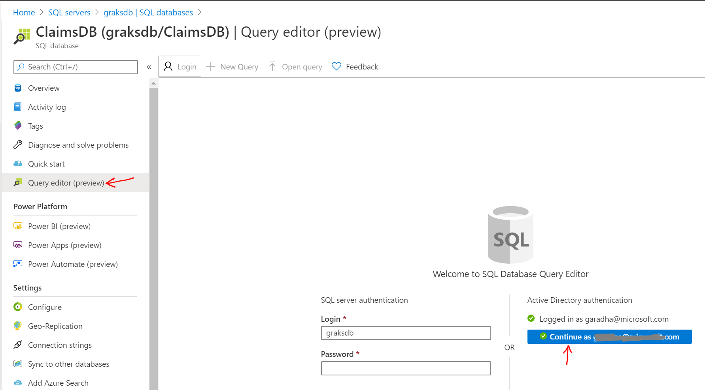

# Use Azure Managed Identity and AAD Pod Identity to access Azure SQL Server Database

This project extension describes the steps for configuring the Claims Web API application to use user-assigned **Managed Identity** to access Azure SQL Database.  **AAD Pod Identity** is used to retrieve managed identity service principal token and authenticate with Azure SQL Server.

*Managed Identities for Azure Resources* makes applications more secure by eliminating secrets such as credentials in connection strings. 

*AAD Pod Identity* enables Kubernetes applications to access cloud resources securely using managed identities and service principals. Without any code modifications, containerized applications can access any resource on Azure cloud that use AAD as an Identity provider.

In this sub-project, you will work on completing the following tasks.

- Install *AAD Pod Identity* components on AKS cluster
- Configure Azure SQL Database to allow *Managed Identity* access to resources (eg., Database Tables)
- Deploy AAD Pod Identity application resources on AKS
- Deploy the Claims Web API application on AKS

**Functional Diagram:**

Refer to the architecture diagram [here](https://docs.microsoft.com/en-us/azure/aks/operator-best-practices-identity#use-pod-identities).

**Prerequisites:**
1. Readers are required to complete Sections A thru G in the [parent project](https://github.com/ganrad/aks-aspnet-sqldb-rest) before proceeding with the hands-on labs in this sub-project.

Readers are advised to refer to the following on-line resources as needed.
- [Azure Active Directory](https://docs.microsoft.com/en-us/azure/active-directory/)
- [Azure AAD Pod Identity](https://github.com/Azure/aad-pod-identity)
- [Managed Identities for Azure resources](https://docs.microsoft.com/en-us/azure/active-directory/managed-identities-azure-resources/overview)
- [Use Managed Identities in AKS](https://docs.microsoft.com/en-us/azure/aks/use-managed-identity)

## A. Install AAD Pod Identity components on AKS Cluster
**Approx. time to complete this section: 25 minutes**

AAD Pod Identity consists of two key components and custom resources.  The two core components are briefly described below.
- **Managed Identity Controller (MIC)**

  The MIC is a custom Kubernetes resource that watches for changes to Pods, Identities and Bindings through the Kubernetes API Server.   When it detects a change, the MIC adds or deletes assigned identities as required.
- **Node Managed Identity (NMI)**

  The NMI component is responsible for intercepting a Service Principal Token request sent by a Pod to an MSI endpoint, retrieving a matching Azure Identity from MIC and then making an [ADAL](https://docs.microsoft.com/en-us/azure/active-directory/azuread-dev/active-directory-authentication-libraries) request to get a token for the client id.  The token is then returned to the Pod (FlexVolume driver).

Follow the steps below to deploy AAD Pod Identity components and custom resources.

1. (If you haven't already) Login into the Linux VM via SSH.
  
   ```bash
   # ssh into the VM. Substitute the public IP address for the Linux VM in the command below.
   $ ssh labuser@x.x.x.x
   #
   ```

2. Deploy MIC, NMI components and custom resources on the AKS cluster.

   ```bash
   # Deploy MIC, NMI components and custom resources for a non-RBAC enabled AKS cluster.
   #
   $ kubectl apply -f https://raw.githubusercontent.com/Azure/aad-pod-identity/master/deploy/infra/deployment.yaml
   #
   # For AKS Clusters, deploy the MIC and AKS add-on exception
   $ kubectl apply -f https://raw.githubusercontent.com/Azure/aad-pod-identity/master/deploy/infra/mic-exception.yaml
   #
   # Verify MIC (Deployments) and NMI (Daemon sets) pods have been deployed on the cluster.
   # The pods will be deployed in the 'default' namespace.  There should be as many instances of
   # NMI pods running as there are nodes in the cluster (1 pod on each node).
   #
   $ kubectl get pods -n default -o wide
   #
   ```

3. Create an Azure Managed Identity in the AKS **Cluster/Node** Resource Group.

   Save the values of `clientId` and `id` from the command output.

   ```bash
   # Create a managed identity in the AKS 'Node' Resource Group. The resource group name should have a 'MC_'
   # prefix..
   # Make sure you are logged in to your Azure account and have configured the correct subscription.
   # Substitute correct values for the following parameters:
   # - node-resource-group => Azure Kubernetes Service Cluster/Node resource group 
   # - name => Managed Identity name eg., claims-api-mid
   #
   $ az identity create -g <node-resource-group> -n <name> -o json
   # Important: Save the json output of the above command in a file !! We will need to use 'clientId',
   # 'id' and other values from the json output in the subsequent commands below.
   #
   ```

4. Assign Roles to AKS cluster Service Principal.

   Assign the AKS Service Principal, **Managed Identity Operator** and **Virtual Machine Contributor** roles for (scope of) the **Cluster** Resource Group.

   ```bash
   # Retrieve the AKS cluster service principal id.
   # Substitute correct values for the following parameters:
   # - resource-group => Resource group in which Azure Kubernetes Service is deployed
   # - name => AKS cluster name
   #
   $ az aks show -g <resource-group> -n <name> --query servicePrincipalProfile.clientId -o tsv
   #
   # Assign the 'Managed Identity Operator' role to the AKS cluster service principal on the
   # 'Node' resource group
   # Substitute correct values for the following parameters:
   # - sp-id => AKS Service Principal ID (output of previous command)
   # - subscription-id => Azure Subscription ID
   # - node-resource-group => Azure Kubernetes Service Node resource group 
   #
   $ az role assignment create --role "Managed Identity Operator" --assignee <sp-id> --scope /subscriptions/<subscription-id>/resourcegroups/<node-resource-group>
   $ az role assignment create --role "Virtual Machine Contributor" --assignee <sp-id> --scope /subscriptions/<subscription-id>/resourcegroups/<node-resource-group>
   #
   ```

## B. Configure Azure SQL Database
**Approx. time to complete this section: 15 minutes**

To allow **Managed Identity** access to Azure SQL Database resources (eg., Tables), a managed identity user has to be created in the database and granted specific roles.  This would allow the managed identity user to manipulate data in the database tables.

1. Login to the Azure Portal.

   Login to the [Azure Portal](https://portal.azure.com) using your credentials.

2. Configure Active Directory Admin account for Azure SQL Server.

   In order to create a managed identity **user** in Azure SQL, an Azure Active Directory **Account** is required. Use Azure Portal to set the AD Admin Account for Azure SQL by following the steps below.

   Access the Azure SQL Server instance and click on **Active Directory admin** blade as shown in the screenshot below

   

   Click on **Set admin**.

   In the **Add admin** window, search for your AD Account Name and click **Select** as shown in the screenshot below.

   

3. Create Azure SQL Managed Identity User and Grant roles.

   In Azure SQL Server service, access the **SQL databases** blade and click on the **Database** name as shown below.

   

   Select **Query editor** blade and then click on your account name under **Active Directory authentication** as shown in the screenshot below.

   

   Run the following T-SQL commands in the **Query** panel/window.  Click **Run**.

   ```bash
   # IMPORTANT:
   # Substitute the correct value for the managed identity name.
   # - managed-id-name => Managed Identity name eg., claims-api-mid.
   #
   CREATE USER [managed-id-name] FROM EXTERNAL PROVIDER;
   ALTER ROLE db_datareader ADD MEMBER [managed-id-name];
   ALTER ROLE db_datawriter ADD MEMBER [managed-id-name];
   ALTER ROLE db_ddladmin ADD MEMBER [managed-id-name];
   GO
   ```

   See screenshot below.

   

## C. Deploy AAD Pod Identity resources on AKS
**Approx. time to complete this section: 10 minutes**

1. Create a new Kubernetes namespace for deploying Claims Web API application.
  
   ```bash
   # Create a new Kubernetes namespace 'dev-claims-mid' for deploying the Claims Web API application
   #
   $ kubectl create namespace dev-claims-mid 
   #
   ```

2. Install Azure Pod Identity Kubernetes resource.

   This custom Kubernetes resource contains the ID's of the Azure Managed Identity.

   ```bash
   # Switch to the 'use-pod-identity-mid' directory.
   $ cd ./extensions/use-pod-identity-mid
   #
   # Edit the Pod Identity Kubernetes manifest file `./k8s-resources/azureIdentity.yaml`, update 
   # values for the following two attributes and then save the file.
   # - ResourceID => 'id' attribute value of the managed identity created in Section A step 3
   # - ClientID => 'clientId' value of the managed identity created in Section A step 3
   #
   # Deploy the pod identity custom resource on AKS
   $ kubectl apply -f ./k8s-resources/azureIdentity.yaml -n dev-claims-mid
   #
   # Verify the Azure Identity resource got created in Kubernetes
   $ kubectl get azureidentity -n dev-claims-mid  
   #
   ```

6. Install the Azure Pod Identity Binding Kubernetes resource.
  
   This custom Kubernetes resource binds the Claims Web API Pod (via the 'selector') with the Azure Managed Identity.

   ```bash
   # Deploy the pod identity binding custom resource on AKS
   $ kubectl apply -f ./k8s-resources/azureIdentityBinding.yaml -n dev-claims-mid
   #
   # Verify the Azure Identity Binding resource got created in Kubernetes
   $ kubectl get azureidentitybinding -n dev-claims-mid  
   #
   ```

## D. Deploy the Claims Web API application on AKS
**Approx. time to complete this section: 30 minutes**

Login to the Linux VM (Bastion Host) via an SSH terminal window.

Execute the steps below to deploy the Claims Web API application on AKS.

1. Modify the Claims Web API application configuration file.

   Copy `./appsettings.json` file to the project root (**parent**) directory.  View the contents of this application configuration file and you will notice that the Azure SQL Connection String (**SqlServerDb**) doesn't have the DB username or password.  See below.

   ```bash
   # 'appsettings.json' file contents
   #
     "ConnectionStrings": {
        "SqlServerDb": "Server=tcp:claimsdb.database.windows.net,1433;Database=ClaimsDB;"
     }
   #
   ```

   **Add** this file to the local git repository on the Linux VM. 

2. Modify Claims Web API application (code).

   Update the Entity Framework database context class to retrieve the access token for Azure SQL Database.  In the project root (**parent**) directory, edit class `./Models/ClaimsContext.cs`.  Uncomment the two lines (lines: 5 and 6) as shown in the code snippet below.

   ```cs
   // Uncomment lines 5 and 6
   // 
   public ClaimsContext(DbContextOptions<ClaimsContext> options) : base(options) {
     var conn = (Microsoft.Data.SqlClient.SqlConnection) Database.GetDbConnection();
     conn.AccessToken = (new Microsoft.Azure.Services.AppAuthentication.AzureServiceTokenProvider()).GetAccessTokenAsync("https://database.windows.net/").Result;
   }
   ```
   
   **Add** this class to the local git repository on the Linux VM.

   **Commit** the updated files to your local git repository.  Finally, **Push** the local updates to your GitHub repository (your forked repo.).

3. Define and execute an Build Pipeline in Azure DevOps.

   Login to [Azure DevOps Services](https://dev.azure.com/) portal and define a simple *Pipeline*.  The pipeline should contain 2 tasks as detailed below.

   - Docker **Build** Task: This task builds the Claims Web API application and application container image.
   - Docker **Push** Task: This task pushes the built application container image to ACR.


4. Update the Kubernetes deployment manifest.

   Log back into the Linux VM.

   Switch to this project extensions directory `./extensions/use-pod-identity-mid`.  Edit the Kubernetes application deployment manifest `./k8s-resources/deployment.yaml`.  Specify correct values for attributes listed in the table below.

   | Attribute Name | Description |
   | -------------- | ----------- |
   acr-name | Name of the Azure Container Registry instance |
   tag-name | Azure DevOps Pipeline **Build ID**.  Login to Azure Portal. Get the latest build ID from ACR **claims-api** repository. |

   In case you have deployed an Ingress Controller (Nginx / Traefik) on the AKS cluster, you can also expose the API endpoint on the ingress controller by deploying an *Ingress* resource (left as an exercise).

5. Deploy the Claims Web API application.

   ```bash
   # Install the Claims Web API application in namespace 'dev-claims-mid'
   # 
   $ kubectl apply -f ./k8s-resources/deployment.yaml --namespace dev-claims-mid
   #
   # Verify the Claims Web API pod is running
   $ kubectl get pods -n dev-claims-mid
   #
   ```

6. Access the Claims Web API application.

   ```bash
   # Get the ALB IP address for the Claims Web API endpoint
   # The ALB Public IP address should be listed under column 'EXTERNAL-IP' in the command output.
   #
   $ kubectl get svc -n dev-claims-mid
   #
   ```

   Access the Claims Web API service using a browser eg., http://[ALB Public IP]/api/v1/claims.

Congrats! In this project extension, you installed **AAD Pod Identity** components on the AKS Cluster. You then configured the Claims Web API application to retrieve an OAuth token from Azure AD using **Managed Identity**. This token was used by the application to authenticate to Azure SQL Server.  Finally, you deployed the application on AKS and verified the application is able to retrieve and send Claims documents to the SQL Database.
